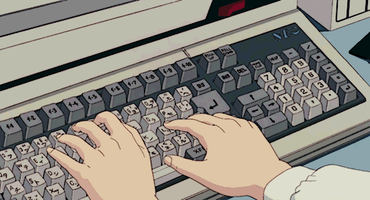

# Hi! I'm Anna!

  

## About me 

- I’m interested in Swift
- I’m currently learning Swift, Linux
- How to reach me: tg: @b0l0gur
- Fun fact: Now I'm learning in School21

## Language & DevTools

- **Languages**: C, C++, Swift
- **Frameworks**: Qt, UIKit, SpriteKit
- **Databases**: PostgreSQL, Realm
- **Other**: Git, Bash, Docker, CI/CD, PJAdmin, CocoaPods, JSON

## My stats on github

## My Project

### Swift
| Project name | Description | Stack       |
|--------------|-------------|-------------|
| [Swift_Bootcamp](https://github.com/BalagurovaA/Swift_Bootcamp)   | Executing a bootcamp on School 21 program in Swift language  | Swift |
| [Diary_App](https://github.com/BalagurovaA/diary)  | A test assignment to create a diary app  | Swift, Realm  |

### C++
| Project name | Description | Stack       |
|--------------|-------------|-------------|
| [BrickGame_Snake](https://github.com/BalagurovaA/CPP_BrickGame_snake) | Implementation of the Snake game application in the C++ language | C++, Qt, GTest, Makefile, MVC |
| [3DViewer](https://github.com/BalagurovaA/CPP_3DViewer) |Application for displaying 3D images in C++ language | C++, Qt, openGL, GTest, Makefile |

### C
| Project name | Description | Stack       |
|--------------|-------------|-------------|
| [SmartCalc](https://github.com/BalagurovaA/C_SmartCalc) | Implementation of the calculator application in the C language | C, Qt, check.h, Makefile |
| [BrickGame_Tetris](https://github.com/BalagurovaA/C_BrickGame_tetris) | Implementation of the Tetris game application in the C language | C, MVP, Qt, check.h, ncurses.h, Makefile |

<!-- ### DevOps
| Project name | Description | Stack       |
|--------------|-------------|-------------| -->

<!-- ### SQL

<!-- ##  Social media

<!-- добавить лидкод -->
<!-- - [Telegram](https://t.me/eflorentia)
- [Email](mailto:a.sharafutdinovva@gmail.com) -->

